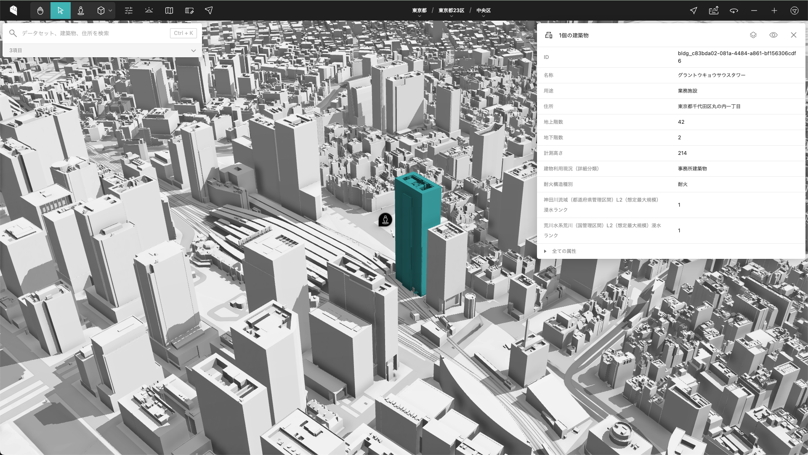

# PLATEAU VIEW 3.0

PLATEAU VIEW 3.0 は以下のシステムにより構成されます。

- **PLATEAU CMS**: ビューワーに掲載する各種データの管理・配信を行う。
- **PLATEAU Editor**: ビューワーの作成・公開をノーコードで行う。
- **PLATEAU VIEW**: PLATEAUをはじめとする様々なデータセットの可視化が可能なWebアプリケーション。

システムの詳細な仕様は、[PLATEAU VIEW構築マニュアル](https://www.mlit.go.jp/plateau/file/libraries/doc/plateau_doc_0009_ver04.pdf)を参照してください。

また、本ソースコードはProject PLATEAUの令和5年度のユースケース開発業務の一部であるUC11「ストーリーテリング型 GIS を用いたエリアマネジメントの高度化」の成果物ソースコードでもあります。ストーリーテリング機能については、[storytelling.md](./docs/storytelling.md)を参照してください。

## フォルダ構成

- [cms](cms): PLATEAU CMS（[Re:Earth CMS](https://github.com/reearth/reearth-cms)）
- [editor](editor): PLATEAU Editor（[Re:Earth](https://github.com/reearth/reearth)）
- [extension](extension): PLATEAU VIEW で使用する Re:Earth のエクステンション
- [geo](geo): PLATEAU VIEW の一部機能（住所検索など）を動作させるためのサーバーアプリケーション
- [server](server): PLATEAU CMS のサイドカーサーバー（CMSと共に補助的に動作するサーバーアプリケーション）
- [terraform](terraform): PLATEAU VIEW 3.0　をクラウド上に構築するための Terraform
- [tiles](tiles): geoからタイル配信の機能のみを独立させたサーバーアプリケーション
- [tools](tools): PLATEAU CMS でのデータ登録作業や移行作業を補助するCLIツール
- [worker](worker): サイドカーサーバーから呼び出され非同期に実行されるワーカーアプリケーション

## ライセンス

[Apache License Version 2.0](LICENSE)
