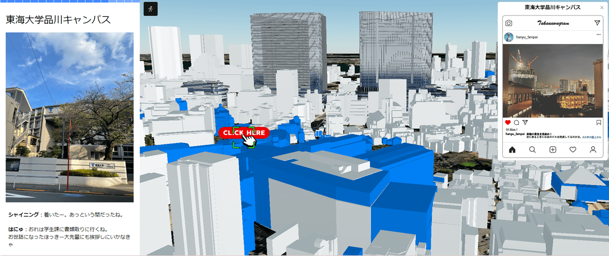

# WebGIS「Re:Earth」のスクロール型ストーリーテリング機能

## 1．概要

本リポジトリでは、Project PLATEAU の令和 5 年度のユースケース開発業務の一部である UC11「ストーリーテリング型 GIS を用いたエリアマネジメントの高度化」について、その成果物である WebGIS「Re:Earth」に追加実装した「スクロール型ストーリーテリング機能」のソースコードを公開しています。

「スクロール型ストーリーテリング機能」は、WebGIS「Re:Earth」上に新たな編集画面として開発しており、ユーザーによる Web サイトのスクロール操作に合わせて順番にコンテンツが展開されるスクロール型ストーリーテリングのコンテンツをノーコードで制作することができる機能です。

## 2.「ストーリーテリング型 GIS を用いたエリアマネジメントの高度化」について

「ストーリーテリング型 GIS を用いたエリアマネジメントの高度化」では、WebGIS「Re:Earth」に追加機能を実装することで、大規模な再開発が進む高輪ゲートウェイエリア駅周辺エリアを舞台としたエリアマネジメント団体による対外的な情報発信の質を向上させることを目的として本機能の開発を行いました。本機能は、従来の「Re:Earth」における GeoJOSN・3D Tiles・MVT 等といった様々なデータの扱い方を刷新した新たな編集画面として実装されています。これにより、スクロール動作によるシームレスな 2D と 3D マップの切替や、GeoJSON・KML・CZML・3D Tiles 等の様々な形式の GIS データや画像データ等の表示切替、スクロールに合せたカメラ遷移、テキスト・動画・画像等のコンテンツの表示切替、クリックによる 3D マップのカメラ遷移やコンテンツの表示切替、時間軸を持ったコンテンツの任意の時刻での表示といった、スクロール型ストーリーテリングを豊かにする様々な機能を実現しています。

## 3.利用手順

本システムの構築手順については、「実証環境構築マニュアル」を参照してください。
また、構築した環境でのスクロール型ストーリーテリング機能の利用手順については利用チュートリアル[Github Pages のリンクを挿入]を参照してください。

## 4.システム概要

### Re:Earth 機能（既存機能）

#### ① アカウント作成・ログイン

- 「Re:Earth」のアカウントを作成し、ログインできる

#### ② プロジェクト作成・編集・保存

- プロジェクト名・プロジェクト概要文・サムネイル画像の設定ができる
- カメラの位置、建物モデルの描画などをノーコードで設定ができる
- タイムラインの再生・停止や 3D のアニメーション再生ができる
- インフォボックスの作成・編集ができる
- インフォボックスの表示ができる
- ナビゲーターの表示ができる
- 作成したプロジェクトが自動で保存される

#### ③ プロジェクトのプレビュー・公開

- 設定したビジュアライゼーション（プロジェクト）を公開後の UI で確認できる
- プロジェクトの公開・非公開、ベーシック認証、カスタムドメインの設定ができる
- 設定したビジュアライゼーション（プロジェクト）を Web ページとして一般公開ができる

#### ④ プラグイン機能

- JavaScript で提供される API を通して、ユーザーがプラグインによる拡張機能を提供できる
- プラグインエディター画面を通してプラグインの開発ができる
- 本ユースケースでプラグインとして利用している機能
  - インフォボックスにコメント投稿フォームおよびいいねボタンを追加する機能
  - classic エディターからエクスポートしたマーカーおよびインフォボックスを Beta エディター上で表示する機能
  - 3D Tiles の地物が保持する情報をインフォボックスとして表示する機能

### スクロール型ストーリーテリング機能（新規開発機能）

#### ⑤ スクロール型ストーリーテリングの作成・編集・削除

- プロジェクト新規作成時にストーリーテリングのプロジェクトを作成するかどうかのポップアップを表示する
- ストーリーテリングのプロジェクトの作成・編集・削除を行う
- プロジェクト名・プロジェクト概要文・サムネイル画像の設定ができる
- プロジェクト作成画面で、複数のエディターの切替えができる
- レイヤーを作成・編集・削除するレイヤーエディター
- ストーリーテリングのコンテンツを作成・編集・削除するストーリーテリングエディター
- プロジェクトの公開画面のプレビュー画面
- プロジェクト作成画面で、プロジェクトの公開を行う

#### ⑥「ページ」の作成・編集・削除

- ストーリーテリングエディターから「ページ」の追加・編集・削除を行う
  - 「ページ」のタイトルの編集
  - 「ページ」の初期カメラ位置の設定・編集
- 「ページ」のパーマネントリンク（クリックによる遷移が可能なボタン）が作成される
- 「ページ」の設定
  - 背景色（色・透明度）の設定
  - 「ページ」位置（左・右）の設定

#### ⑦ シーンの追加・編集・削除

- レイヤーエディターを通してシーンの編集ができる
  - 背景地図（Base-map）の設定
  - 背景地図の地形（Terrain）の設定
  - 初期カメラ位置の設定
  - 影や太陽光、大気の設定

#### ⑧ レイヤーの作成・編集・削除

- レイヤーエディターを通してレイヤーの作成・編集・削除ができる
- レイヤーエディターを通して、 GeoJSON や 3DTiles データに対してデータが持つ属性を使用してオブジェクトの色を変更したり、ラベルを表示させるスタイル用のコード（JSON）を記述したりすることができる
- ストーリーテリングエディターからレイヤーを参照できる
- ストーリーテリングエディターから「ページ」ごとのレイヤーの表示・非表示ができる

#### ⑨ スクロールに応じた「ページ」切り替え

- スクロールに応じてシームレスに「ページ」が切り替わる
- 各「ページ」ごとのパーマネントリンクのクリックによる「ページ」切り替えができる

#### ⑩「ページ」ごとのブロックの設定の追加・編集・削除

- ブロックの表示・追加・編集・削除ができる
- マークダウンブロック
  - フォントのサイズ（見出し）設定
  - 太文字
  - イタリック体
  - テキストリンク
  - 引用テキスト
- 画像ブロック
  - ファイルアップロード／URL 入力
  - Left/Center/Right の位置
- 動画ブロック
  - URL 入力
  - Left/Center/Right の位置
- カメラ移動ブロック（ボタンクリックでカメラ移動）
  - 緯度・経度・高さ
  - Heading/Pitch/Roll
  - 現在のカメラ位置のキャプチャ
- タイムラインブロック（タイムラインをブロック内で操作できる）
  - 自動再生 / 手動再生
  - ループ再生 / 一度きり再生
  - 現在時刻
  - タイムラインの範囲（始まりと終わり）
- レイヤー選択ブロック（ボタンクリックで指定のレイヤーをセレクト）
  - レイヤーの表示 / 非表示を切り替える

## 5．利用技術

| 　種別           | 名称                 | バージョン | 内容                                                                                                                                                                                                                            |
| ---------------- | -------------------- | ---------- | ------------------------------------------------------------------------------------------------------------------------------------------------------------------------------------------------------------------------------- |
| WebGIS           | 「Re:Earth」         | 0.14       | ユーカリヤ社が提供するOSSのWeb GISのプラットフォーム。ノーコードで地図やデジタル地球儀を使用したWebアプリケーションを作成・公開することができる。                                                                 |
| ライブラリ       | CesiumJS             | 1.104.0    | Cesium GS社が開発するデジタル3D地球儀上に様々な情報を描画することができる地図エンジン。「Re:Earth」内の描画に使用している。                                                                                                                                  |
|                  | React                | 18.2.0     |Meta社が開発するUI構築のためのJavaScriptライブラリ。                                                                                                                                                                                           |
|                  | Resium               | 1.16.1     | ユーカリヤ社が開発するReact上でCesiumJSを手軽に利用可能にするコンポーネントを提供するライブラリ。                                                                                                                                      |
|                  | GraphQL              | --         | Meta社が開発するAPI向けに作られたクエリ言語及びランタイムを指す。WebAPIの開発において、RESTなどの方式と比較して、より柔軟かつ効率的なAPIの提供を可能にする規格。                                                                                 |
| クラウドサービス | Cloud Run            | --         | Google社が提供するクラウドサービス。HTTPサーバーとして外部からのリクエストを受信している。MongoDBやファイルストレージと連携して、レイヤーの保存やプロジェクトの管理・公開などの、様々なビジネスロジックを実行する。「Re:Earth」のAPIサーバーを動かすために使用している。|
|                  | Google Cloud Storage | --         | Google社が提供するクラウドサービス。フロントエンドのアプリケーションのソースコードや画像、ユーザーによってアップロードされたアセットファイルや、プロジェクト公開時にビルドされる情報、インストールされたプラグインのファイルを保存する。|
|                  | Cloud CDN            | --         |Google社が提供するクラウドサービス。GCPのCDN（Content Deliver Network = Webコンテンツをインターネット経由で配信するために最適化されたネットワーク）。リクエスト元から地理的に近いサーバーにコンテンツをキャッシュし、コンテンツ配信を効率化させることができる|
|                  | Cloud DNS            | --         | Google社が提供するクラウドサービス。GCPのDNSとなり、「Re:Earth」で使用しているドメインに対応するレコードは全てCloud DNSで管理されている。|
|                  | Cloud Load Balancing | --         |Google社が提供するクラウドサービス。GCPのマネージドなロードバランサ（負荷分散システム）。リクエストのホスト（ドメイン）に応じてAPIサーバーやストレージサーバーに自動的にルーティングされる。|
|                  | Cloud Logging        | --         | Google社が提供するクラウドサービス。GCPのログ収集サービス。Cloud Runなどから出力されるログを閲覧可能で、システムのトラブルシューティング時に役立つ。 |
|                  | MongoDB              | --         | MongoDB社が提供するクラウドサービス。ドキュメント指向のNoSQLデータベースで、データの柔軟性と拡張性が特徴。「Re:Earth」はデータベースとしてMongoDBを使用している |
|                  | Auth0                | --         | Okta社が提供するクラウドサービス。アカウントの管理・認証・認可を行うIDプロバイダを提供する。「Re:Earth」もAuth0を使用して認証認可機能を実現している。 |

## 6．動作環境

「Re:Earth」が保障する動作環境に準ずる。
| 項目 | 動作環境 |
| ---- | ---- |
| Re:Earth の動作環境について | Re:Earth は Web ブラウザ上で動作するアプリケーションであり、インターネット接続が必須。オフライン作業には未対応。 io ドメインが動作する環境。 |
| 対応 Web ブラウザ | Chrome 58+／Firefox 57+／Safari 11+（macOS のみ）／Microsoft Edge 91+ |
| 対応 OS | Windows 10+／Apple macOS 10.12 (macOS Sierra)+ |
| 対応ディスプレイモニタ | 効率的な編集作業には、解像度が 1000x700 ピクセル以上のモニタが必要。 |
| グラフィックカード | 地球儀の表示等に WebGL を利用しているため、WebGL をサポートするグラフィックカード及びグラフィックチップが必要。近年の PC やタブレット端末で利用されている CPU であれば問題なく動作する。 |
| メモリ | 8GB 以上搭載の PC |

## 7．本リポジトリのフォルダ構成

PLATEAU View3.0 の構成に準ずる

## 8．ライセンス

- ソースコード及び関連ドキュメントの著作権は国土交通省に帰属します。
- 本ドキュメントは[Project PLATEAU のサイトポリシー](https://www.mlit.go.jp/plateau/site-policy/)（CCBY4.0 及び政府標準利用規約 2.0）に従い提供されています。

## 9．注意事項

- 本リポジトリは参考資料として提供しているものです。動作保証は行っていません。
- 本リポジトリについては予告なく変更又は削除をする可能性があります。
- 本リポジトリの利用により生じた損失及び損害等について、国土交通省はいかなる責任も負わないものとします。

## 10．参考資料

- 技術検証レポート: URL
- PLATEAU Web サイトの Use case ページ「ストーリーテリング型 GIS を用いたエリアマネジメントの高度化」: https://www.mlit.go.jp/plateau/use-case/uc23-11/