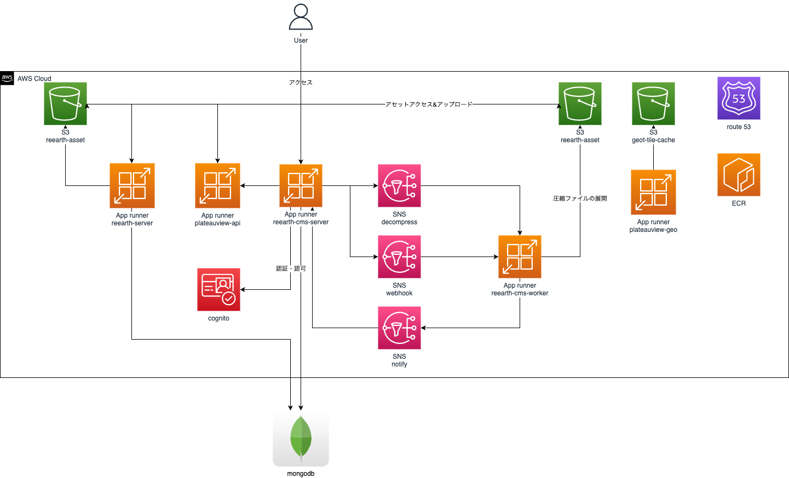

# PLATEAU VIEW 3.0 Terraform for AWS

PLATEAU VIEW 3.0（CMS・Editor・VIEW）をAWS（Amazon Web Service）で構築するためのTerraform用ファイルです。システム構築手順は[『実証環境構築マニュアル Series No.09』](https://www.mlit.go.jp/plateau/file/libraries/doc/plateau_doc_0009_ver03.pdf)（以下、マニュアル）も併せて参照してください。



## 1. 改訂履歴

- 2024/03/15: 初版

## 2. 使用ツール

このマニュアルに従ってシステムを構築するためには、マニュアルの（１）使用ソフトウェア・サービスに記載されているものに加え、以下のツールが必要です。

- [aws-cli](https://docs.aws.amazon.com/ja_jp/cli/latest/userguide/getting-started-install.html)
  - `aws-cli/2.13.15`: 検証済み
- [Terraform](https://www.terraform.io/)
  - `v1.7.4`: 検証済み

## 3. 手順

### 3.1 Terraform変数ファイルの用意

最初に、[terraform.tfvars.example](./env/terraform.tfvars.example) をコピーします。

```console
cp env/terraform.tfvars.example env/terraform.tfvars
```

> [!TIP]
> ここでは`terraform.tfvars`と命名しましたが拡張子`tfvars`であれば何でも構いません。

### 3.2 `aws-cli`のセットアップ

`aws-cli` を使用して、AWS環境にアクセスできるようにします。
`aws-cli` のセットアップは利用している環境に合わせてセットアップしてください。

以下のcomandを実行し、出力される情報から作成予定のAWSアカウントかどうか確認しててください。
```console
aws sts get-caller-identity
```

```json
{
    "UserId": "xxxxxxxxxxxxxxx:example@example.com",
    "Account": "00123456789",
    "Arn": "arn:aws:sts::00123456789:assumed-role/**************/example@example.com"
}

```
### 3.3 s3バケットの作成

Terraformのバックエンドで使用するためのS3バケットを作成します。
```console
##初期セットアップ
terraform init

terraform apply -target=module.tfstate
...
tfstate_bucket_name="${作成されたバケット名}"
```

その後、Terraformバックエンドの設定をを行います。
`terraform.tf`の`backend`の`bucket`に設定します。


```diff
terraform {
+ backend "s3" {
+   bucket = "${作成されたバケット名}"
+   key = "terraform.tfstate"
+   region = "使用しているリージョン"
+  }

  required_providers {
  ...
}
```

その後、もう一度 `terraform init` を行い、`terraform.tfstate` を S3にアップロードします。
```console
terraform init
```

### 3.4 MongoDB Atlasのセットアップ

[MongoDB Altas](https://www.mongodb.com/atlas)へログインして、デプロイメント(データベース)および接続に必要な以下の設定を行います。

- 読み取り/書き込み権限を所有するデータベースユーザーの作成
- IPアドレスの許可 (インターネットからアクセスを許可するためCIDR`0.0.0.0/0`を追加)

> [!WARNING]
> CIDR`0.0.0.0/0`でアクセスを許可するとインターネット上からアクセスできるようになるため、データベースユーザーの管理には十分注意してください。

データベース作成完了後に、データベース詳細ページから接続文字列（Connection String）を取得します。

### 3.5 Terraform変数の設定

これまで構築してきたAWS、MongoDBなどの情報を`terraform.tfvars`に設定します。

### 3.6 Route53 パブリックゾーンの作成およびゾーンの委譲

以下のコマンドを実行し、Route53 パブリックゾーンを作成します。

```console
terraform apply --target aws_route53_zone.public_zone
```

マネージドゾーン名を取得し、以下のコマンドを実行して`NS`レコードを取得します。

```console
aws route53 list-resource-record-sets --hosted-zone-id /hostedzone/Z01251093SKX99FOVRAZN --query "ResourceRecordSets[?Type == 'NS'].ResourceRecords[*].Value"
```

出力された`NS`レコードを、ドメインのレジストラで、ドメインのネームサーバーとして設定してください。
設定方法は各レジストラによって異なりますので、レジストラのドキュメントを参照してください。

### 3.7 ECRのセットアップ

以下のコマンドを実行し、ECRを作成します。

```console
terraform apply -target module.reearth_ecr -target module.reearth_cmsecr
```

ECRを作成後、dockerhubより各イメージをpullし、ECRにpushします。

```console
export AWS_ACCOUNT_ID="AWSアカウントID"
export AWS_REGION="作成対象のリージョン"
#ECRへログイン

aws ecr get-login-password  | docker login --username AWS --password-stdin ${AWS_ACCOUNT_ID}.dkr.ecr.${AWS_REGION}.amazonaws.com

#dockerhubからイメージを取得
docker pull eukarya/plateauview2-reearth:latest
docker tag eukarya/plateauview2-reearth:latest ${AWS_ACCOUNT_ID}.dkr.ecr.${AWS_REGION}.amazonaws.com/reearth-api
docker push ${AWS_ACCOUNT_ID}.dkr.ecr.${AWS_REGION}.amazonaws.com/reearth-api

docker pull eukarya/plateauview-geo:latest
docker tag eukarya/plateauview-geo:latest ${AWS_ACCOUNT_ID}.dkr.ecr.${AWS_REGION}.amazonaws.com/plateauview-api
docker push ${AWS_ACCOUNT_ID}.dkr.ecr.${AWS_REGION}.amazonaws.com/plateauview-api

docker pull eukarya/plateauview-geo:latest
docker tag eukarya/plateauview-geo:latest${AWS_ACCOUNT_ID}.dkr.ecr.${AWS_REGION}.amazonaws.com/plateauview-geo
docker push ${AWS_ACCOUNT_ID}.dkr.ecr.${AWS_REGION}.amazonaws.com/plateauview-geo

docker pul eukarya/plateauview2-reearth-cms:latest
docker tag eukarya/plateauview2-reearth-cms:latest ${AWS_ACCOUNT_ID}.dkr.ecr.${AWS_REGION}.amazonaws.com/reearth-cms
docker push ${AWS_ACCOUNT_ID}.dkr.ecr.${AWS_REGION}.amazonaws.com/reearth-cms
```


### 3.8 関連リソースの作成

以下のコマンドを実行し、関連リソースを作成します。

```console
terraform apply -target module.reearth -target module.reearth_cms module.cognito
```

### 3.9 ドメインのセットアップ

以下のコマンドを実行し、残りのサービスを作成します。

```console
terraform apply -target module.reearth_custom_domain -target module.reearth_cms_custom_domain
```

再度、すべてのリソースを作成するために以下のコマンドを実行します。

```console
terraform apply
```

実行が成功すると、以下のような出力が表示されます。

```console
terraform apply
...
plateauview_cms_url = "*"
plateauview_cms_webhook_secret = <sensitive>
plateauview_cms_webhook_url = "*"
plateauview_geo_url = "*"
plateauview_reearth_url = "*"
plateauview_sdk_token = <sensitive>
plateauview_sidebar_token = <sensitive>
plateauview_sidecar_url = "*"
plateauview_tiles_url = "*"
```

これらの出力は、あとでログインするときに使います。なお、もう一度表示したいときは`terraform output`コマンドで表示することができます。また、`sensitive`と表示されているものは、マスクされており、以下のようなコマンドで実際の値を確認してください。

```console
terraform output <確認したいOutput>
```

| 変数 | 説明 |
| --- | --- |
| `plateauview_cms_url` | CMS（Re:Earth CMS）のURL |
| `plateauview_cms_webhook_secret` | 下記「CMS インテグレーション設定」で使用 |
| `plateauview_cms_webhook_url` | 下記「CMS インテグレーション設定」で使用 |
| `plateauview_geo_url` | タイルなどを変換・処理するサーバーのURL |
| `plateauview_reearth_url` | エディタ（Re:Earth）のURL |
| `plateauview_sdk_token` | PLATEAU SDK用のトークン。SDKのUIで設定する（詳しくはマニュアルを参照） |
| `plateauview_sidebar_token` | ビューワのサイドバー用のAPIトークン。エディタ上でサイドバーウィジェットの設定から設定する（詳しくはマニュアルを参照） |
| `plateauview_sidecar_url` | サイドカーサーバーのURL。エディタ上でサイドバーウィジェットの設定から設定する（詳しくはマニュアルを参照） |
| `plateauview_tiles_url` | タイル配信サーバーのURL |

### 3.10 DNS・ロードバランサ・証明書のデプロイ完了の確認

実際に`curl`コマンドなどでリクエストを送って、デプロイが完了していることを確認します。

```console
curl https://api.${DOMAIN}/ping
```

### 3.12 CMS インテグレーション設定

Terraformのの `plateauview_cms_url` のURL（`https://reearth.${DOMAIN}`）からRe:Earth CMSにログインします。

ログイン後、ワークスペース・Myインテグレーションを作成します。

次に、インテグレーション内に以下の通り webhook を作成する。作成後、有効化を忘れないこと。

- URL: `terraform outputs`の`plateauview_cms_webhook_url`
- シークレット: `terraform outputs`の`plateauview_cms_webhook_secret`
- イベント: 全てのチェックボックスにチェックを入れる。

作成後、作成したワークスペースに作成したインテグレーションを追加し、オーナー権限に変更する。

先ほど作成したインテグレーションの詳細画面でインテグレーショントークンをコピーし、以下の `${REEARTH_PLATEAUVIEW_CMS_TOKEN}` に貼り付けて以下のコマンドを実行する。

```console
aws ssm put-parameter --name "/reearth-cms/REEARTH_PLATEAUVIEW_CMS_TOKEN" -type "String" --value "${REEARTH_PLATEAUVIEW_CMS_TOKEN}"
```

環境変数の変更を適用するため、もう一度 `App Runner` をデプロイしてください。

```console
## reearth-cmsのServiceArnを取得
export REEARTH_CMS_SERVICE_ARN=`aws apprunner list-services --region us-east-1 --query "ServiceSummaryList[?ServiceName == 'reearth-cms-server'].ServiceArn"`

## AppRunnerの更新
aws apprunner  start-deployment --service-arn ${REEARTH_CMS_SERVICE_ARN}
```


### 4. RE:EARTH のユーザー作成
Cogito上で新規にユーザーを作成します。
AWSのマネジメントコンソールより
Cognito -> ユーザープール -> ユーザー -> ユーザーを作成 を選択し、ユーザーを作成する
その後、作例された情報を元に、以下のパラメーターを埋め、実行する

```console
curl -H 'Content-Type: application/json' https://reearth.${DOMAIN}/api/signup -d @- << EOF
{
  "sub": "YOUR AUTH0 ACCOUNT ID",
  "email": "YOUR AUTH0 ACCOUNT EMAIL",
  "username": "YOUR AUTH0 ACCOUNT NAME",
}
```

### 5. 完了

以下のアプリケーションにログインし、正常に使用できることを確認します。ここの `${DOMAIN}` はドメインです。

- Re:Earth: Terraformのoutputsの `plateauview_reearth_url` の値（`https://reearth.${DOMAIN}`）
- Re:Earth CMS: Terraformのoutputsの `plateauview_cms_url` の値（`https://cms.${DOMAIN}`）

この後は画面上での設定作業になります。続きは[マニュアル](https://www.mlit.go.jp/plateau/file/libraries/doc/plateau_doc_0009_ver03.pdf)をご覧ください。
